# Micro-Frontend Mindmaps

#### What

In this repository, you will find mindmaps we created about Micro-Frontend based on public information. As all of the information is already in the public domain, please feel free to use and share these mindmaps however you like.  

#### What is Micro-Frontend ?

Micro-frontends are the technical representation of a business subdomain, they allow independent implementation with the same and different technology.

Please find the key factors for micro-frontends below.

- Decomposed
- Independent
- Tech-Agnostic
- Deployable Separately
- Loosely Coupled
- Customizable
- Updated Incrementally
- Fault-Tolerant

#### The History of Microfrontends

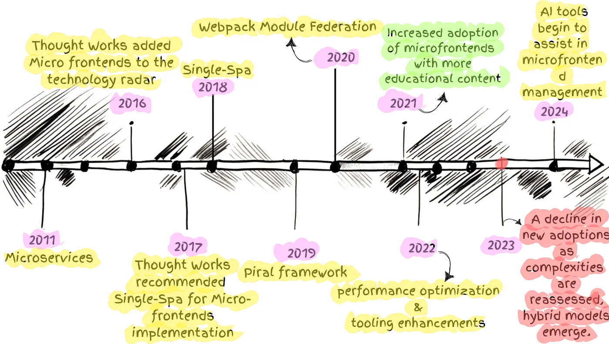

- 2011: Microservices
- 2016: [Thought Works added Micro frontends to the technology radar](https://www.thoughtworks.com/radar/techniques/micro-frontends)
- Nov 2017: [Thought Works recommended Single-Spa for Micro-frontends implementation](https://www.thoughtworks.com/en-in/radar/languages-and-frameworks/single-spa)
- 2019: [Martin Fowler wrote his article about Micro-frontends and promoted Micro-frontends architecture in his article “Micro Frontends.”](https://martinfowler.com/articles/micro-frontends.html)
- Apr 2020: [We see microfrontend architect design as a trend early in 2020 - Software Architecture and Design InfoQ Trends](https://www.infoq.com/articles/architecture-trends-2020/)
- Oct 2020: [By the end of 2020, Zack Jackson released his masterpiece “Module Federation” as a plugin in Webpack 5](https://webpack.js.org/concepts/module-federation/)
- 2021: Discovery
- Apr 2021: [Thought-works started to recommend Module Federation for Micro-frontends implementations](https://www.thoughtworks.com/radar/languages-and-frameworks/webpack-5-module-federation)

#### Micro-frontends decisions framework

The 4 pillars that we need to decide up-front when architecting micro-frontends, as stated by [Luca Mezzalira](https://github.com/lucamezzalira) here in his medium article - [Micro-frontends decisions framework](https://medium.com/@lucamezzalira/micro-frontends-decisions-framework-ebcd22256513).

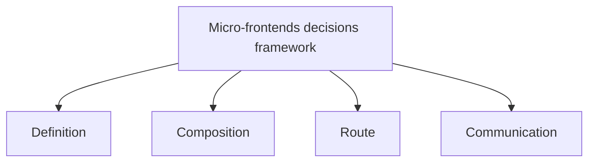

#### Defining Micro-Frontends

Identifying micro-frontends becomes quite straightforward. Understanding how users behave is of great use in determining our micro-frontends. You can read Luca Mezzalira's full article [here](https://medium.com/dazn-tech/identifying-micro-frontends-in-our-applications-4b4995f39257) for more details.

[Identifying micro-frontends in our applications](https://medium.com/dazn-tech/identifying-micro-frontends-in-our-applications-4b4995f39257)

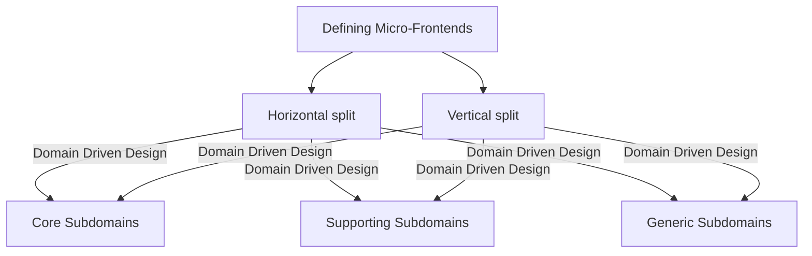

#### Composition of Micro-frontends

Analyzing how different frameworks can be used with different micro frontends on the same page.

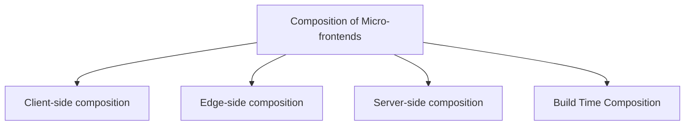

##### 1. Client-side composition

Client Side Composition is one of the patterns that combine Fragments on client-side

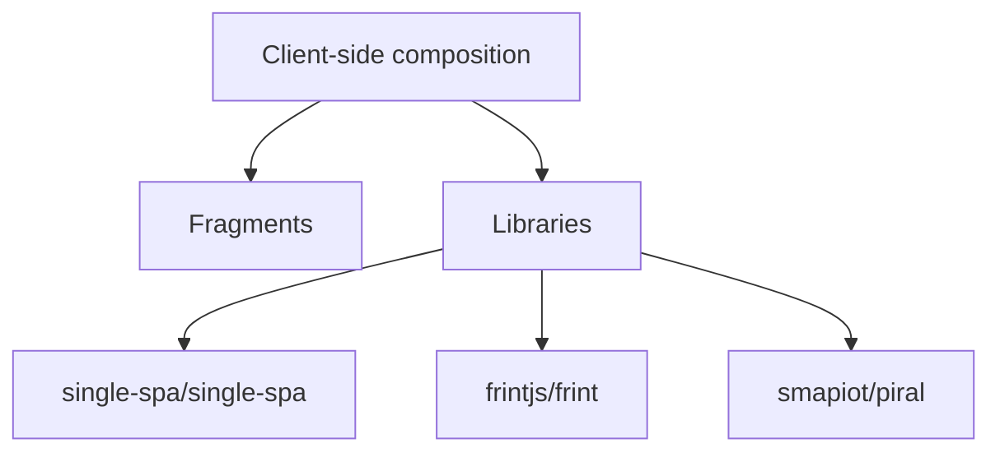

##### 2. Edge-side composition
Basically its combination of client side and server side composition to take the advantages of CDN caching.
Idea behind edge-side composition – fragments are stitched together, close to the client. 

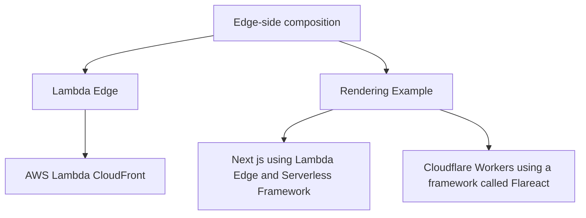

##### 3. Server-side composition
Pattern that assembles Fragments on the server side.

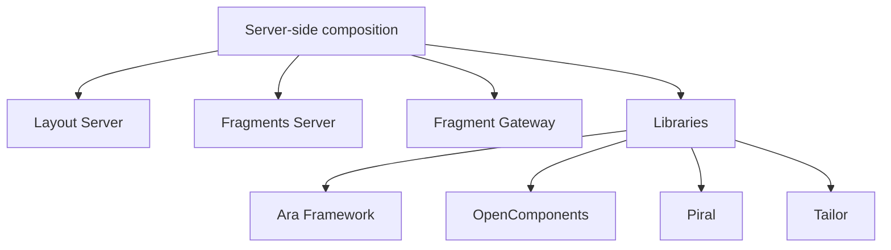

##### 4. Build Time Composition
Build Time Composition assembles Fragments at build time, not at client or server. Publish each micro frontend as a package, and have the container application include them all as library dependencies.

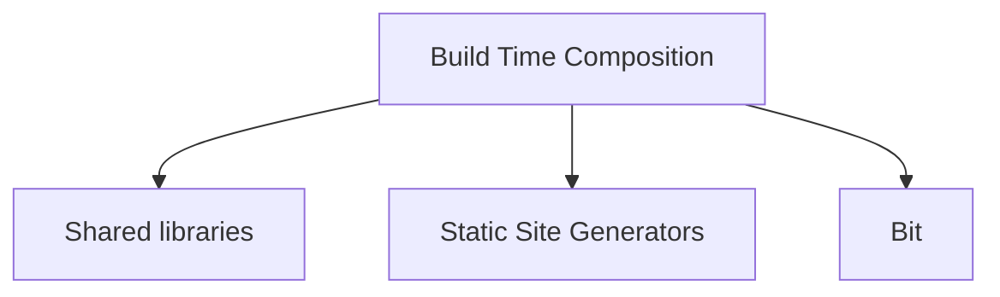

#### Micro-Frontends Communication

There are sometimes UI fragments belonging to different teams that need to interact or communicate. When a user adds an item to the basket by clicking the buy button, other micro frontends such as the mini basket want to be notified to update their content accordingly. 

##### 1. User interface communication

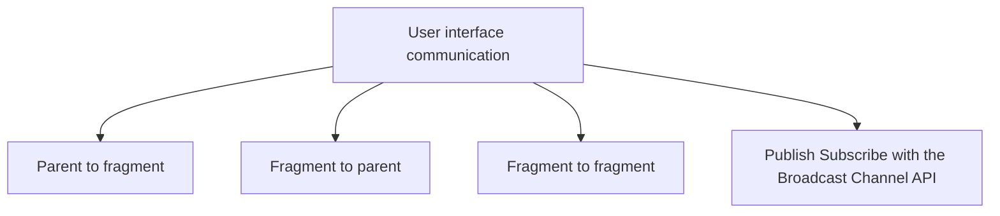

##### 2. Sharing state

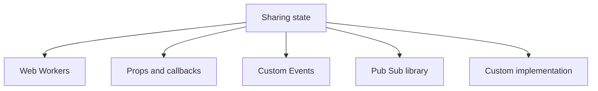

#### Micro-Frontends Communication Patterns

##### 1. Parent to Fragment

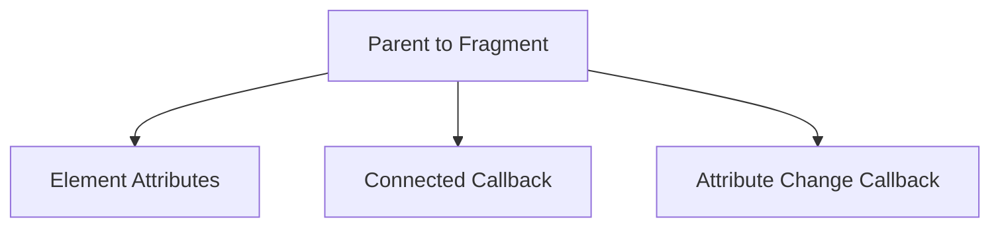

##### 2. Fragment to Parent

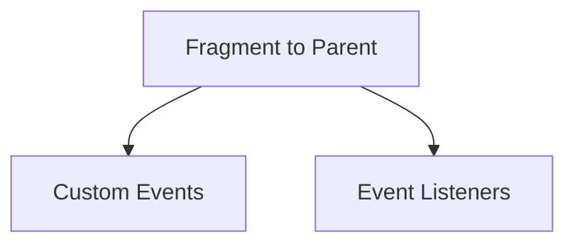

##### 3. Fragment to Fragment

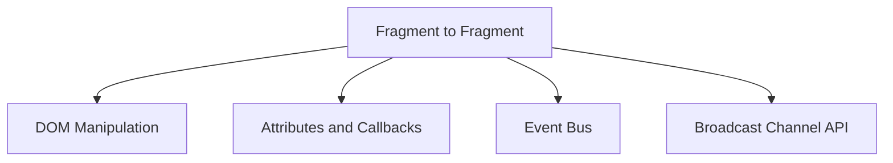

##### 4. Global Communication

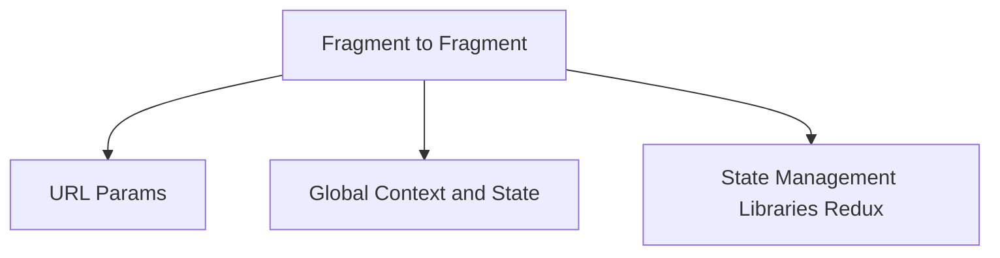

#### Micro-Frontends anti-patterns

- Difference between micro-frontend and component
- Multi frameworks approach
- Write programs that do thing and do it well
- Dependency hell
- Unidirectional flow at the rescue
- Avoid organizational coupling
- Multiple micro-frontends calling same endpoint

##### 1. Difference between micro-frontend and component

A micro-frontend is a technical representation of a business subdomain that has a specific behavior that is controlled by the self.

A Component is a technical solution for any frontend element that has a specific behavior that may be modified by a controlled component or container.

| Component | Micro-Frontends |
| :---: | :---: | 
| Technical Solution | Technical Representation of business subdomain |
|  Having a specific behavior that may be modified by a controlled component or container. | Having some Behaviour but driven by self |

#### Implementation of  Micro Frontends

There are several ways to implement a microfrontend, and this article([3 Ways to Build Micro-Frontends](https://javascript.plainenglish.io/3-ways-to-develop-micro-frontends-in-2022-e29984158b6d)) will help you understand them.

According to my understanding, the application shell is the most crucial component of a micro-frontend architecture, as it is the component that enables you to render your all micro-frontends inside of a container.

###### Application shell

The application shell serves as the parent application to all micro-frontends. All incoming requests arrive there, It selects the micro-frontend that the user wishes to view and renders it in the <body> documents.

#### Micro Frontends Frameworks

1. [Bit](https://bit.dev/)
2. [Webpack 5 and Module Federation](https://webpack.js.org/concepts/module-federation/)
3. [Single SPA](https://single-spa.js.org/)
4. [Systemjs](https://github.com/systemjs/systemjs)
5. [Piral](https://github.com/smapiot/piral)
6. [Open Components](https://github.com/opencomponents/oc)
7. [Qiankun](https://github.com/umijs/qiankun)
8. [Luigi](https://luigi-project.io/)
9. [FrintJS](https://github.com/frintjs/frint)
10. [Mosaic 9](https://www.mosaic9.org/)
11. [PuzzleJS](https://github.com/puzzle-js/puzzle-js)

#### Microfrontends with Module Federation

Module federation allows a JavaScript application to dynamically run code from another bundle/build, on both client and server.

- loading the module (asynchronous)
- evaluating the module (synchronous)

##### Why Use Module Federation?

- Better way to share code : Expose any code from any application that Webpack supports.
- Environment-Independent : Use shared code in different environment web, Node.js etc.
- Resolves Dependency Issues : Federated code defines their dependencies and if Webpack can’t find it in the scope, will download it.
- Modernize Legacy Applications: The microfrontend approach divides a frontend into smaller, deployable parts, but is crucial for real-time scenarios with legacy applications and modernization, as companies may be reluctant to rewrite entire applications.

###### Advanced Topics

- Version Mismatches
- Dynamic Federation
- Mono vs. Multirepo
- Multiple Frameworks/Versions
#### [Summary](https://www.xmind.net/m/nfT7ef/) 

### Case Studies

- [Experiences Using Micro Frontends at IKEA](https://www.infoq.com/news/2018/08/experiences-micro-frontends/)
- [What is a Micro Frontend? Examples and Mobile App Benefits](https://ionic.io/resources/articles/micro-frontends-for-mobile-with-ionic-portals)
  

#### When to use Micro Frontends ?

Each pattern, as we know, has advantages and disadvantages, and in order to use it, we must establish a boundary between these and our requirements.

- Ideal for large, fast-growing, and complex enterprise applications.
- Provides implementation independence, preventing blockages and bottlenecks.
- Ideal for independent deployments, allowing frequent updates without disrupting the entire application.
- Ideal for fast-paced environments requiring agility and quick response to changing marketing demands.
- Can accommodate different technology stacks, allowing teams to select the technology stack that best suits their needs
- Minimizes the risk of failure by detaching or detanglering different components of the application
- Enables collaboration between multiple, independent teams on a single application
- Creates a flexible application, allowing different configurations for different user types.
- Ideal for gradual modernization of existing solutions, allowing for gradual replacement of old components with micro-frontends.

#### References

1. [Mindmap](https://www.xmind.net/m/nfT7ef/)
2. [Behind leroymerlin.fr: Micro Frontends](https://medium.com/adeo-tech/behind-leroymerlin-fr-micro-frontends-47fd7c53f99d)
3. [Resources to start with Micro Frontend](https://gist.github.com/santoshshinde2012/ff346ae8aca26644fe15409847138e49)
4. [Micro Frontends Conference](https://hasgeek.com/jsfoo/microfrontends-conf/videos)
5. [Micro frontend resources](https://github.com/billyjov/microfrontend-resources)
6. [Four Micro-frontend Anti-patterns](https://blog.santoshshinde.com/four-micro-frontend-anti-patterns-58aaa9fe19d5)
7. [What’s the Difference Between a Component and a Micro-Frontend?](https://javascript.plainenglish.io/whats-the-difference-between-a-component-and-a-micro-frontend-43aefd0af062)
8. [Awesome Micro-Frontends](https://github.com/rajasegar/awesome-micro-frontends)
9. [Use React components inside Angular](https://github.com/microsoft/angular-react)
10. [Micro Frontend Architecture: Helping you move from theory to practice with our workshop](https://www.nearform.com/digital-community/micro-frontend-architecture-helping-you-move-from-theory-to-practice-with-our-workshop)
11. [Micro Frontends — The Better Way to Modernize Legacy Applications](https://medium.com/@johnlawrimore/micro-frontends-a-game-changing-strategy-for-legacy-app-migrations-6288f50a6f72)
12. [Micro frontend architecture](https://www.rst.software/blog/micro-frontend-architecture-101-what-is-it-when-to-use-it-and-how-to-migrate-your-existing-monolithic-app-in-9-steps)
13. [Microfrontends: Are We Solving Problems or Creating Them?](https://medium.com/gitconnected/microfrontends-are-we-solving-problems-or-creating-them-35f1098b0820?sk=6c4acc16fe754bfc09fd666db6dca08a)

#### Videos
1. [Micro-frontend Anti-patterns](https://www.youtube.com/watch?v=b9Zpi-oajA0)
2. [Micro-Frontends with Module Federation: Beyond the Basics](https://www.youtube.com/watch?v=tzXCrCwybgE)

#### Courses

1. [Microfrontends with React: A Complete Developer's Guide](https://www.udemy.com/course/microfrontend-course/learn/lecture/23206792#overview) by [Stephen Grider](https://www.linkedin.com/in/stephengrider)

### Recent Medium Posts

<table>
  <tr><th>Title</th><th>Categories</th></tr>
  <!-- BLOG-POST-LIST:START --><tr><td><a target='_blank' href=https://medium.com/@mihirzalavadiya1/frameworkless-frontends-are-micro-frameworks-the-future-850cf3c465eb?source=rss------micro_frontends-5>Frameworkless Frontends Are Micro Frameworks the Future?</a></td><td><code>frontend-development, framework, micro-frontends, frontend, react</code></td></tr><tr><td><a target='_blank' href=https://javascript.plainenglish.io/dependency-hell-why-break-your-microfronend-system-f5d9bb68dfb4?source=rss------module_federation-5>Dependency Hell ? Why Does It Break Your Microfronend System</a></td><td><code>module-federation, dependency-injection, webpack, coding, dependency-hell</code></td></tr><tr><td><a target='_blank' href=https://medium.com/@karthikvellur/front-end-blue-prints-5781969ddd2e?source=rss------micro_frontends-5>Front End Blue Prints</a></td><td><code>frontend-development, micro-frontends, front-end-developer</code></td></tr><tr><td><a target='_blank' href=https://medium.com/rethinking-the-client-a-new-era-of-modular/we-dont-build-software-we-discover-it-5def21cc07e9?source=rss------micro_frontends-5>We Don’t Build Software. We Discover It.</a></td><td><code>micro-frontends, modularity, client-side-microservices, software-architecture, frontend-architecture</code></td></tr><tr><td><a target='_blank' href=https://medium.com/mashroom-server/openmicrofrontends-specification-released-cb1b3ce084a0?source=rss------micro_frontends-5>OpenMicrofrontends Specification Released</a></td><td><code>micro-frontends</code></td></tr><tr><td><a target='_blank' href=https://medium.com/react-native-journal/react-native-microfrontends-a-future-trend-75d28c7bae0c?source=rss------micro_frontends-5>React Native + Microfrontends: A Future Trend</a></td><td><code>micro-frontends, software-architecture, super-apps, react-native, modular-architecture</code></td></tr><tr><td><a target='_blank' href=https://medium.com/react-native-journal/module-federation-in-react-native-is-it-possible-a-practical-step-by-step-guide-89594d6f3c5b?source=rss------micro_frontends-5>Module Federation in React Native: Is It Possible? A Practical, Step-by-Step Guide</a></td><td><code>repack, super-app-architecture, micro-frontends, react-native, module-federation</code></td></tr><tr><td><a target='_blank' href=https://medium.com/react-native-journal/module-federation-in-react-native-is-it-possible-a-practical-step-by-step-guide-89594d6f3c5b?source=rss------module_federation-5>Module Federation in React Native: Is It Possible? A Practical, Step-by-Step Guide</a></td><td><code>repack, super-app-architecture, micro-frontends, react-native, module-federation</code></td></tr><tr><td><a target='_blank' href=https://medium.com/@seyhunak/designing-micro-frontend-mfe-architecture-for-mobile-banking-fintech-applications-0446bcaddb8c?source=rss------micro_frontends-5>Designing Micro-Frontend &lpar;MFE&rpar; Architecture for Mobile Banking/Fintech Applications</a></td><td><code>fintech, banking, micro-frontends, mobile</code></td></tr><tr><td><a target='_blank' href=https://medium.com/@devdevika364/my-journey-into-micro-frontend-by-breaking-the-monolithic-ui-19b38f78e866?source=rss------micro_frontends-5>My Journey into Micro Frontend by Breaking the Monolithic ui</a></td><td><code>micro-frontends</code></td></tr><tr><td><a target='_blank' href=https://medium.com/@satnammca/security-resilience-in-2025-frontend-apps-micro-frontends-csp-and-zero-trust-principles-90689d393eba?source=rss------micro_frontends-5>Security &amp; Resilience in 2025 Frontend Apps: Micro-Frontends, CSP, and Zero-Trust Principles</a></td><td><code>zero-trust, micro-frontends, front-end-development, javascript, security</code></td></tr><tr><td><a target='_blank' href=https://medium.com/@kalyankashaboina07/supercharge-your-cra-react-app-with-vite-for-lightning-fast-local-development-without-touching-76fb3db873b5?source=rss------micro_frontends-5>⚡ Supercharge Your CRA React App with Vite for Lightning-Fast Local Development — Without Touching…</a></td><td><code>frontend-development, javascript, react, micro-frontends, react-vite</code></td></tr><tr><td><a target='_blank' href=https://medium.com/@vishnutejareddynalla/architecting-scalable-react-applications-with-webpack-module-federation-84c5c8136771?source=rss------module_federation-5>Architecting Scalable React Applications with Webpack Module Federation</a></td><td><code>software-development, frontend-architecture, react, module-federation, react-microfrontend</code></td></tr><tr><td><a target='_blank' href=https://medium.com/@ayoobibrahim31/building-micro-frontends-in-angular-using-native-federation-05848c924e27?source=rss------module_federation-5>Building Micro Frontends in Angular Using Native Federation</a></td><td><code>dynamic-load-balancing, module-federation, micro-frontends</code></td></tr><tr><td><a target='_blank' href=https://heshanu97.medium.com/micro-frontend-architecture-and-how-i-implement-to-project-6f114ea0cb60?source=rss------module_federation-5>Micro frontend architecture and how I implement to project.</a></td><td><code>micro-frontends, module-federation, webpack-module-federation</code></td></tr><tr><td><a target='_blank' href=https://windmaomao.medium.com/module-federation-for-micro-frontend-setup-part-c-f856fa54900e?source=rss------module_federation-5>Module federation for micro-frontend setup — part C</a></td><td><code>webpack, module-federation, micro-front-end</code></td></tr><tr><td><a target='_blank' href=https://medium.com/@marqueesolution0/angular-in-micro-frontend-ushering-a-new-epoch-in-scalable-web-development-e9386be39eab?source=rss------module_federation-5>Angular in Micro Frontend: Ushering a New Epoch in Scalable Web Development</a></td><td><code>frontend-architecture, module-federation, web-development, angular, micro-frontends</code></td></tr><tr><td><a target='_blank' href=https://windmaomao.medium.com/module-federation-for-micro-frontend-setup-part-b-853e24e54945?source=rss------module_federation-5>Module federation for micro-frontend setup — part B</a></td><td><code>webpack, module-federation, micro-front-end</code></td></tr><tr><td><a target='_blank' href=https://medium.com/@dirishalasandeep/%EF%B8%8F-managing-i18n-fallbacks-in-react-microfrontends-without-duplicating-english-files-4efac8736e2e?source=rss------module_federation-5>️ Managing i18n Fallbacks in React Microfrontends &lpar;Without Duplicating English Files&rpar;</a></td><td><code>i18next, reactjs, react-i18next, module-federation, micro-frontends</code></td></tr><tr><td><a target='_blank' href=https://windmaomao.medium.com/module-federation-for-micro-frontend-setup-part-a-bf47358c8fb2?source=rss------module_federation-5>Module federation for micro-frontend setup — part A</a></td><td><code>module-federation, react, javascript, webpack, micro-front-end</code></td></tr><!-- BLOG-POST-LIST:END -->
</table>

### Connect with me on

  
  
   
  

