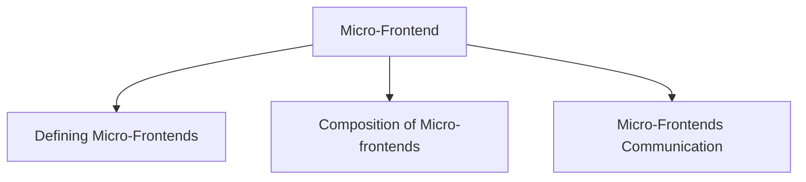
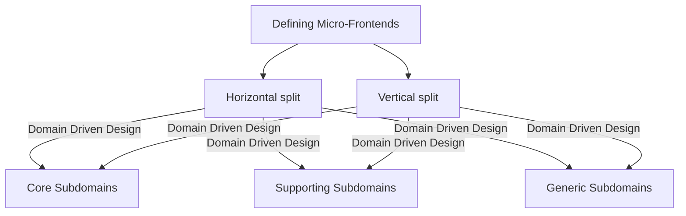
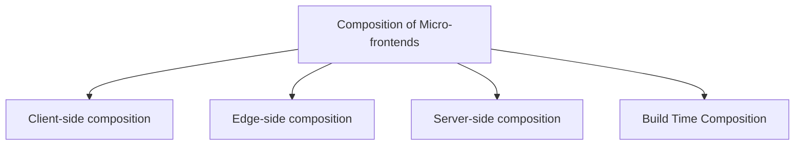
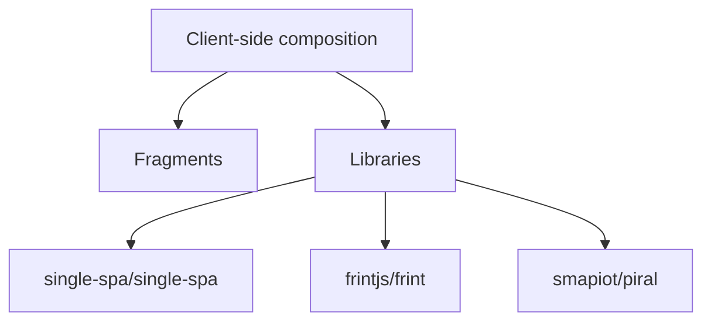
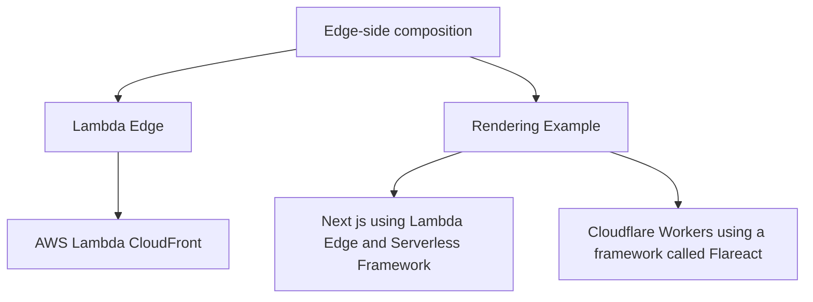
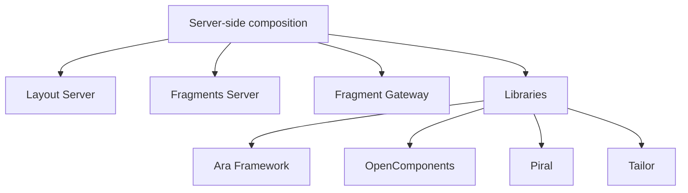
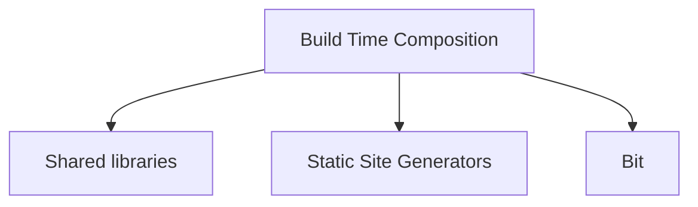
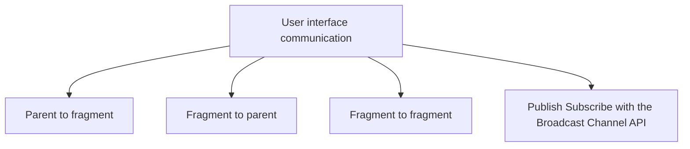
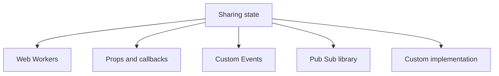

# Micro-Frontend Mindmaps

#### What

This repository contains mindmaps we have created about Micro-Frontend based on public information.  As all of the information is already in the public domain, please feel free to use and share these mindmaps however you like.  

#### What is Micro-Frontend ?

Microfrontends are the technical representation of a business subdomain, they provide strong boundaries with clear contracts, also they avoid sharing logic with other subdomains

#### Defining Micro-Frontends

Identifying micro-frontends becomes quite straightforward. Understanding how users behave is of great use in determining our micro-frontends. You can read Luca Mezzalira's full article [here](https://medium.com/dazn-tech/identifying-micro-frontends-in-our-applications-4b4995f39257) for more details.

[Identifying micro-frontends in our applications](https://medium.com/dazn-tech/identifying-micro-frontends-in-our-applications-4b4995f39257)

#### Composition of Micro-frontends

Analyzing how different frameworks can be used with different micro frontends on the same page.

##### 1. Client-side composition

Client Side Composition is one of the patterns that combine Fragments on client-side

##### 2. Edge-side composition
Basically its combination of client side and server side composition to take the advantages of CDN caching.
Idea behind edge-side composition – fragments are stitched together, close to the client. 

##### 3. Server-side composition
Pattern that assembles Fragments on the server side.

##### 4. Build Time Composition
Build Time Composition assembles Fragments at build time, not at client or server. Publish each micro frontend as a package, and have the container application include them all as library dependencies.

#### Micro-Frontends Communication

There are sometimes UI fragments belonging to different teams that need to interact or communicate. When a user adds an item to the basket by clicking the buy button, other micro frontends such as the mini basket want to be notified to update their content accordingly. 

##### 1. User interface communication

##### 2. Sharing state

#### Summary 

#### References

1. [https://www.xmind.net/m/nfT7ef/](https://www.xmind.net/m/nfT7ef/)
2. [Behind leroymerlin.fr: Micro Frontends](https://medium.com/adeo-tech/behind-leroymerlin-fr-micro-frontends-47fd7c53f99d)
3. [Resources to start with Micro Frontend](https://gist.github.com/santoshshinde2012/ff346ae8aca26644fe15409847138e49)