# Micro-Frontend Mindmaps

#### What

In this repository, you will find mindmaps we created about Micro-Frontend based on public information. As all of the information is already in the public domain, please feel free to use and share these mindmaps however you like.  

#### What is Micro-Frontend ?

Micro-frontends are the technical representation of a business subdomain, they allow independent implementation with the same and different technology.

Please find the key factors for micro-frontends below.

- Decomposed
- Independent
- Tech-Agnostic
- Deployable Separately
- Loosely Coupled
- Customizable
- Updated Incrementally
- Fault-Tolerant

#### The History of Microfrontends

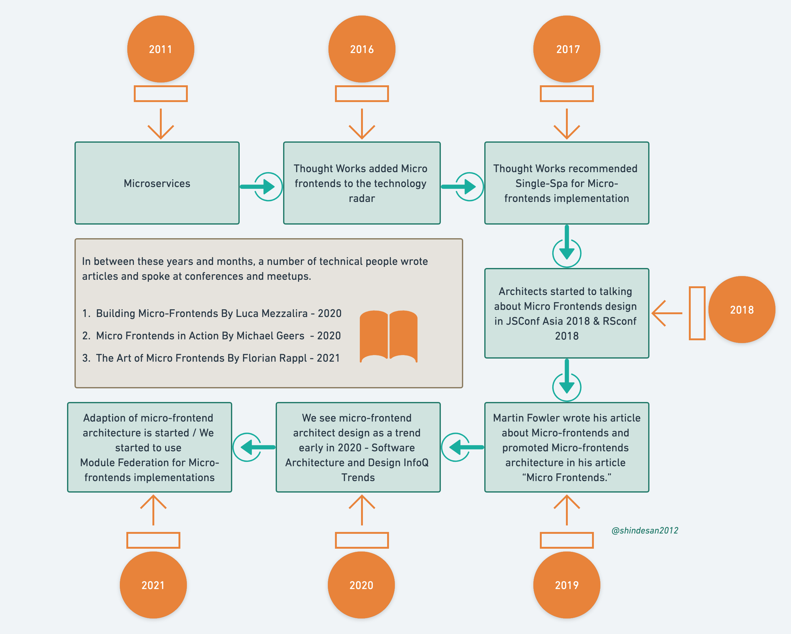

- 2011: Microservices
- 2016: [Thought Works added Micro frontends to the technology radar](https://www.thoughtworks.com/radar/techniques/micro-frontends)
- Nov 2017: [Thought Works recommended Single-Spa for Micro-frontends implementation](https://www.thoughtworks.com/en-in/radar/languages-and-frameworks/single-spa)
- 2019: [Martin Fowler wrote his article about Micro-frontends and promoted Micro-frontends architecture in his article “Micro Frontends.”](https://martinfowler.com/articles/micro-frontends.html)
- Apr 2020: [We see microfrontend architect design as a trend early in 2020 - Software Architecture and Design InfoQ Trends](https://www.infoq.com/articles/architecture-trends-2020/)
- Oct 2020: [By the end of 2020, Zack Jackson released his masterpiece “Module Federation” as a plugin in Webpack 5](https://webpack.js.org/concepts/module-federation/)
- 2021: Discovery
- Apr 2021: [Thought-works started to recommend Module Federation for Micro-frontends implementations](https://www.thoughtworks.com/radar/languages-and-frameworks/webpack-5-module-federation)

#### Micro-frontends decisions framework

The 4 pillars that we need to decide up-front when architecting micro-frontends, as stated by [Luca Mezzalira](https://github.com/lucamezzalira) here in his medium article - [Micro-frontends decisions framework](https://medium.com/@lucamezzalira/micro-frontends-decisions-framework-ebcd22256513).

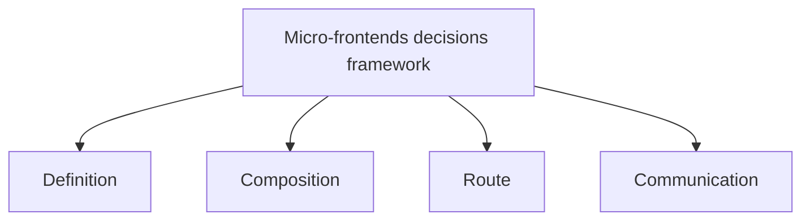

#### Defining Micro-Frontends

Identifying micro-frontends becomes quite straightforward. Understanding how users behave is of great use in determining our micro-frontends. You can read Luca Mezzalira's full article [here](https://medium.com/dazn-tech/identifying-micro-frontends-in-our-applications-4b4995f39257) for more details.

[Identifying micro-frontends in our applications](https://medium.com/dazn-tech/identifying-micro-frontends-in-our-applications-4b4995f39257)

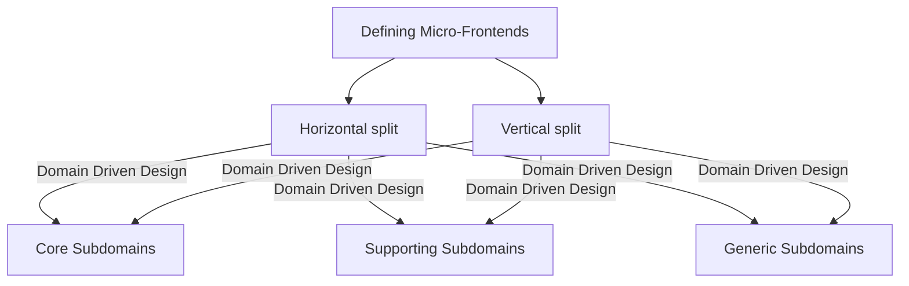

#### Composition of Micro-frontends

Analyzing how different frameworks can be used with different micro frontends on the same page.

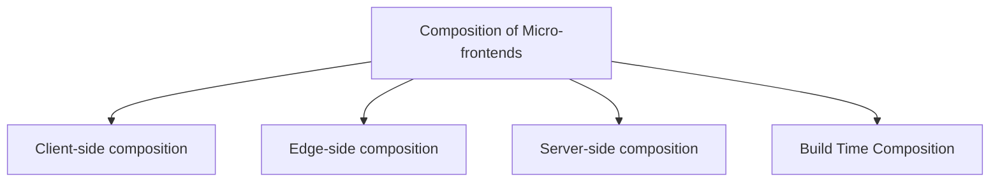

##### 1. Client-side composition

Client Side Composition is one of the patterns that combine Fragments on client-side

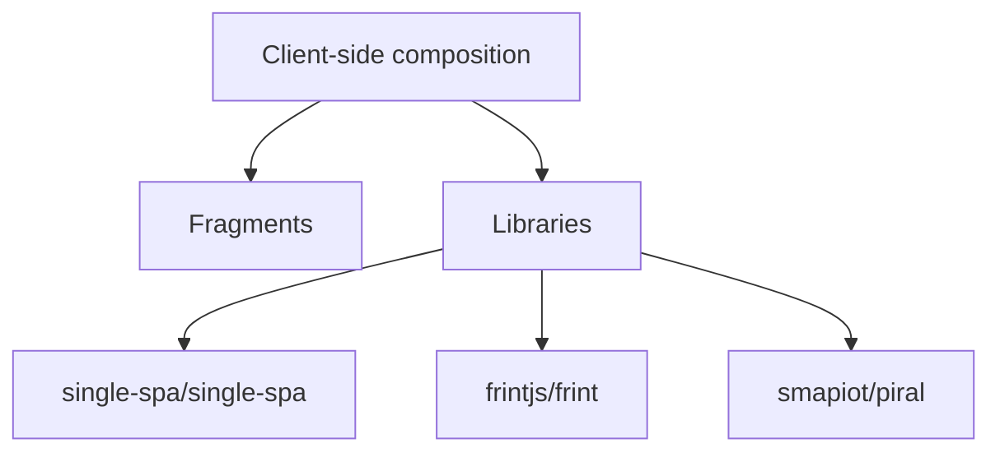

##### 2. Edge-side composition
Basically its combination of client side and server side composition to take the advantages of CDN caching.
Idea behind edge-side composition – fragments are stitched together, close to the client. 

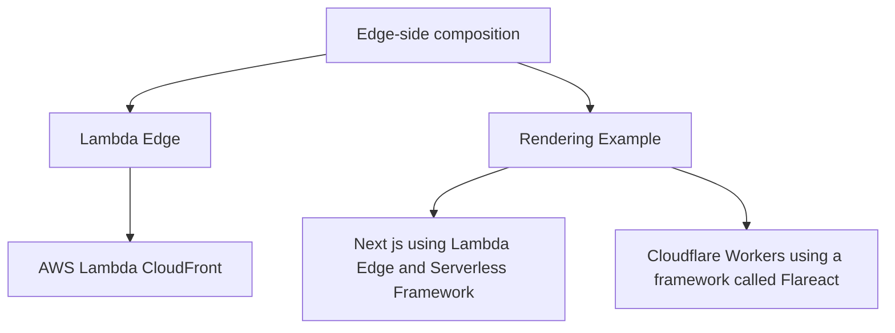

##### 3. Server-side composition
Pattern that assembles Fragments on the server side.

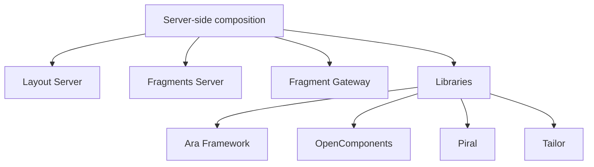

##### 4. Build Time Composition
Build Time Composition assembles Fragments at build time, not at client or server. Publish each micro frontend as a package, and have the container application include them all as library dependencies.

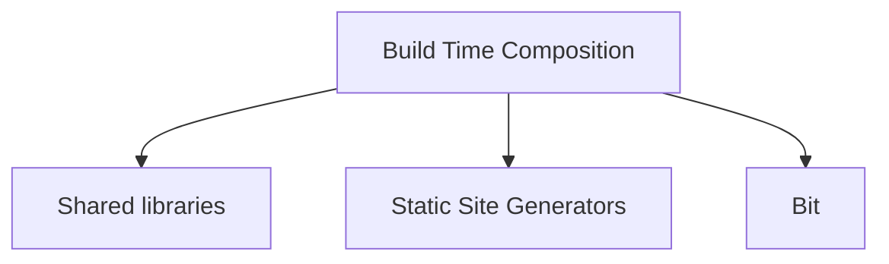

#### Micro-Frontends Communication

There are sometimes UI fragments belonging to different teams that need to interact or communicate. When a user adds an item to the basket by clicking the buy button, other micro frontends such as the mini basket want to be notified to update their content accordingly. 

##### 1. User interface communication

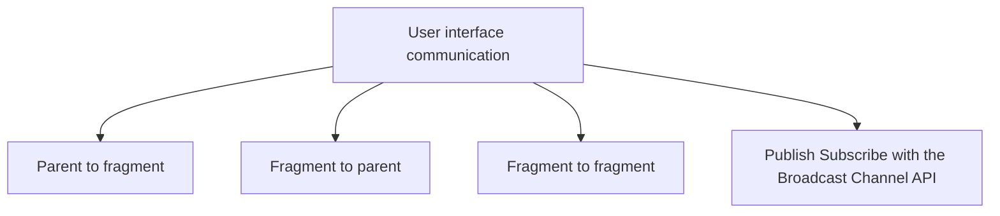

##### 2. Sharing state

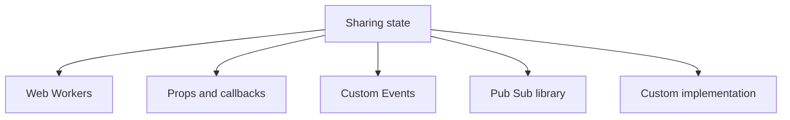

#### Micro-Frontends Communication Patterns

##### 1. Parent to Fragment

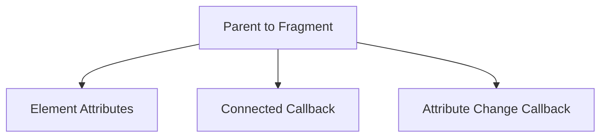

##### 2. Fragment to Parent

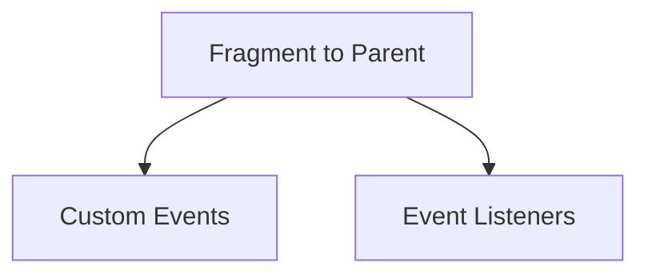

##### 3. Fragment to Fragment

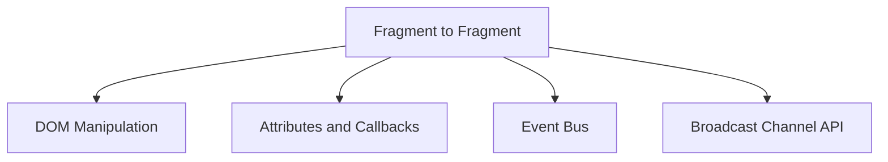

##### 4. Global Communication

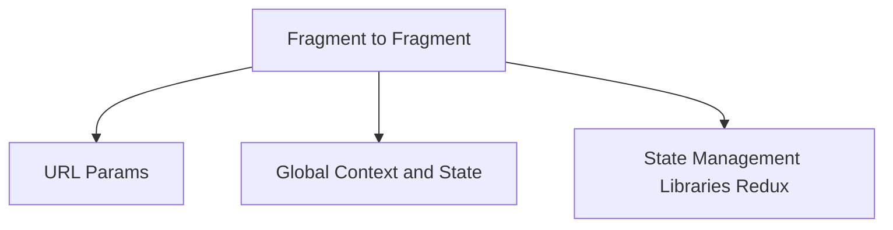

#### Micro-Frontends anti-patterns

- Difference between micro-frontend and component
- Multi frameworks approach
- Write programs that do thing and do it well
- Dependency hell
- Unidirectional flow at the rescue
- Avoid organizational coupling
- Multiple micro-frontends calling same endpoint

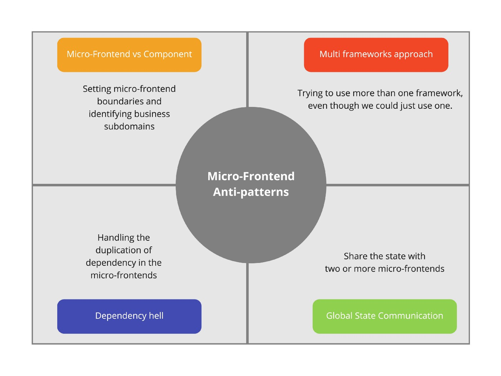

##### 1. Difference between micro-frontend and component

A micro-frontend is a technical representation of a business subdomain that has a specific behavior that is controlled by the self.

A Component is a technical solution for any frontend element that has a specific behavior that may be modified by a controlled component or container.

| Component | Micro-Frontends |
| :---: | :---: | 
| Technical Solution | Technical Representation of business subdomain |
|  Having a specific behavior that may be modified by a controlled component or container. | Having some Behaviour but driven by self |

#### Implementation of  Micro Frontends

There are several ways to implement a microfrontend, and this article([3 Ways to Build Micro-Frontends](https://javascript.plainenglish.io/3-ways-to-develop-micro-frontends-in-2022-e29984158b6d)) will help you understand them.

According to my understanding, the application shell is the most crucial component of a micro-frontend architecture, as it is the component that enables you to render your all micro-frontends inside of a container.

###### Application shell

The application shell serves as the parent application to all micro-frontends. All incoming requests arrive there, It selects the micro-frontend that the user wishes to view and renders it in the <body> documents.

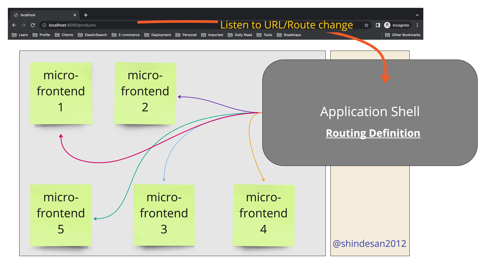

#### Micro Frontends Frameworks

1. [Bit](https://bit.dev/)
2. [Webpack 5 and Module Federation](https://webpack.js.org/concepts/module-federation/)
3. [Single SPA](https://single-spa.js.org/)
4. [Systemjs](https://github.com/systemjs/systemjs)
5. [Piral](https://github.com/smapiot/piral)
6. [Open Components](https://github.com/opencomponents/oc)
7. [Qiankun](https://github.com/umijs/qiankun)
8. [Luigi](https://luigi-project.io/)
9. [FrintJS](https://github.com/frintjs/frint)
10. [Mosaic 9](https://www.mosaic9.org/)
11. [PuzzleJS](https://github.com/puzzle-js/puzzle-js)

#### Microfrontends with Module Federation

Module federation allows a JavaScript application to dynamically run code from another bundle/build, on both client and server.

- loading the module (asynchronous)
- evaluating the module (synchronous)

##### Why Use Module Federation?

- Better way to share code : Expose any code from any application that Webpack supports.
- Environment-Independent : Use shared code in different environment web, Node.js etc.
- Resolves Dependency Issues : Federated code defines their dependencies and if Webpack can’t find it in the scope, will download it.
- Modernize Legacy Applications: The microfrontend approach divides a frontend into smaller, deployable parts, but is crucial for real-time scenarios with legacy applications and modernization, as companies may be reluctant to rewrite entire applications.

###### Advanced Topics

- Version Mismatches
- Dynamic Federation
- Mono vs. Multirepo
- Multiple Frameworks/Versions
#### [Summary](https://www.xmind.net/m/nfT7ef/) 

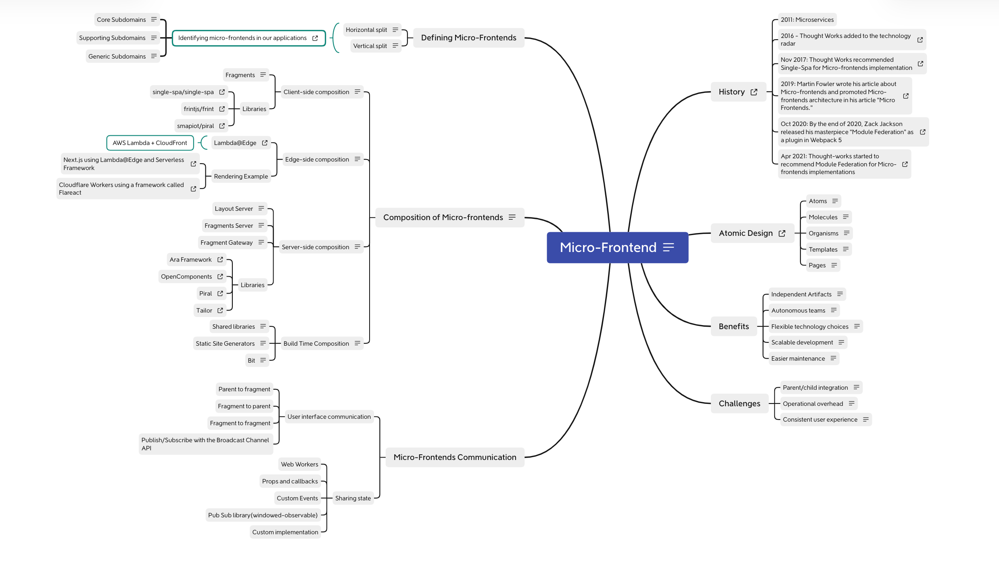

### Case Studies

- [Experiences Using Micro Frontends at IKEA](https://www.infoq.com/news/2018/08/experiences-micro-frontends/)
- [What is a Micro Frontend? Examples and Mobile App Benefits](https://ionic.io/resources/articles/micro-frontends-for-mobile-with-ionic-portals)
  

#### When to use Micro Frontends ?

Each pattern, as we know, has advantages and disadvantages, and in order to use it, we must establish a boundary between these and our requirements.

- Ideal for large, fast-growing, and complex enterprise applications.
- Provides implementation independence, preventing blockages and bottlenecks.
- Ideal for independent deployments, allowing frequent updates without disrupting the entire application.
- Ideal for fast-paced environments requiring agility and quick response to changing marketing demands.
- Can accommodate different technology stacks, allowing teams to select the technology stack that best suits their needs
- Minimizes the risk of failure by detaching or detanglering different components of the application
- Enables collaboration between multiple, independent teams on a single application
- Creates a flexible application, allowing different configurations for different user types.
- Ideal for gradual modernization of existing solutions, allowing for gradual replacement of old components with micro-frontends.

#### References

1. [Mindmap](https://www.xmind.net/m/nfT7ef/)
2. [Behind leroymerlin.fr: Micro Frontends](https://medium.com/adeo-tech/behind-leroymerlin-fr-micro-frontends-47fd7c53f99d)
3. [Resources to start with Micro Frontend](https://gist.github.com/santoshshinde2012/ff346ae8aca26644fe15409847138e49)
4. [Micro Frontends Conference](https://hasgeek.com/jsfoo/microfrontends-conf/videos)
5. [Micro frontend resources](https://github.com/billyjov/microfrontend-resources)
6. [Four Micro-frontend Anti-patterns](https://blog.santoshshinde.com/four-micro-frontend-anti-patterns-58aaa9fe19d5)
7. [What’s the Difference Between a Component and a Micro-Frontend?](https://javascript.plainenglish.io/whats-the-difference-between-a-component-and-a-micro-frontend-43aefd0af062)
8. [Awesome Micro-Frontends](https://github.com/rajasegar/awesome-micro-frontends)
9. [Use React components inside Angular](https://github.com/microsoft/angular-react)
10. [Micro Frontend Architecture: Helping you move from theory to practice with our workshop](https://www.nearform.com/digital-community/micro-frontend-architecture-helping-you-move-from-theory-to-practice-with-our-workshop)
11. [Micro Frontends — The Better Way to Modernize Legacy Applications](https://medium.com/@johnlawrimore/micro-frontends-a-game-changing-strategy-for-legacy-app-migrations-6288f50a6f72)
12. [Micro frontend architecture](https://www.rst.software/blog/micro-frontend-architecture-101-what-is-it-when-to-use-it-and-how-to-migrate-your-existing-monolithic-app-in-9-steps)

#### Videos
1. [Micro-frontend Anti-patterns](https://www.youtube.com/watch?v=b9Zpi-oajA0)
2. [Micro-Frontends with Module Federation: Beyond the Basics](https://www.youtube.com/watch?v=tzXCrCwybgE)

#### Courses

1. [Microfrontends with React: A Complete Developer's Guide](https://www.udemy.com/course/microfrontend-course/learn/lecture/23206792#overview) by [Stephen Grider](https://www.linkedin.com/in/stephengrider)

### Recent Medium Posts

<table>
  <tr><th>Title</th><th>Categories</th></tr>
  <!-- BLOG-POST-LIST:START --><tr><td><a target='_blank' href=https://medium.com/@alexandre.pisani.ant/benefits-of-developing-different-business-apps-in-react-with-webpack-and-module-federation-plugin-b46cd132cd1e?source=rss------module_federation-5>Benefits of developing different business Apps in React with Webpack and Module Federation plugin</a></td><td><code>webpack, mfe, module-federation, docker, react</code></td></tr><tr><td><a target='_blank' href=https://medium.com/@amalhan43/exploring-micro-frontends-76fee6ac8697?source=rss------micro_frontends-5>Exploring Different Types of Micro Frontends</a></td><td><code>micro-frontends, react-microfrontend, types-of-microfrontends</code></td></tr><tr><td><a target='_blank' href=https://medium.com/@erick.98zanetti.98/understanding-the-difference-between-native-federation-module-federation-and-single-spa-6cd6d29029b5?source=rss------module_federation-5>Understanding the Difference Between Native Federation, Module Federation, and Single-Spa</a></td><td><code>single-spa, module-federation, native-federation, angular</code></td></tr><tr><td><a target='_blank' href=https://blog.bitsrc.io/scaling-microfrontends-every-developer-should-know-47e40b299d18?source=rss------micro_frontends-5>Scaling Microfrontends: Every Developer Should Know</a></td><td><code>front-end-development, web-development, micro-frontends, software-architecture</code></td></tr><tr><td><a target='_blank' href=https://blog.bitsrc.io/javascript-monorepos-understanding-their-limitations-and-exploring-decentralized-alternatives-06e25024d4bf?source=rss------micro_frontends-5>JavaScript Monorepos: Exploring Decentralized Alternatives</a></td><td><code>micro-frontends, javascrip, monorepo, typescript, microservices</code></td></tr><tr><td><a target='_blank' href=https://javascript.plainenglish.io/micro-frontends-vs-monolithic-frontends-choosing-the-right-approach-b8e9a5d5c4e3?source=rss------micro_frontends-5>Micro-frontends vs. Monolithic Frontends: Choosing the Right Approach</a></td><td><code>javascript-development, javascript-tips, monolithic-architecture, micro-frontends, javascript</code></td></tr><tr><td><a target='_blank' href=https://kasata.medium.com/implementing-micro-frontend-architecture-a-practical-guide-9a1b4f32551b?source=rss------micro_frontends-5>Implementing Micro-Frontend Architecture: A Practical Guide</a></td><td><code>web-development, micro-frontends, frontend-development, architecture, software-engineering</code></td></tr><tr><td><a target='_blank' href=https://medium.com/@mohd.jilshak/micro-frontend-build-time-composition-and-run-time-composition-9690b72ebaeb?source=rss------micro_frontends-5>Micro Frontend- Build Time Composition and Run Time Composition</a></td><td><code>micro-front-end, microservices, micro-frontends, frontend-architecture, react-microfrontend</code></td></tr><tr><td><a target='_blank' href=https://medium.com/@tapas4java/microfrontends-breaking-down-your-monolith-frontend-application-f3a7c6d38cce?source=rss------micro_frontends-5>Microfrontends: Breaking Down Your Monolith Frontend Application</a></td><td><code>architecture, micro-frontends, react, angular, mfe</code></td></tr><tr><td><a target='_blank' href=https://kasata.medium.com/a-deep-dive-into-micro-frontend-architecture-324c144ddf02?source=rss------micro_frontends-5>A Deep Dive into Micro Frontend Architecture</a></td><td><code>architecture, javascript, web-development, frontend, micro-frontends</code></td></tr><tr><td><a target='_blank' href=https://blog.stackademic.com/building-a-micro-frontend-application-with-next-js-14-2-and-tailwind-css-part-iv-ad787ceabfc5?source=rss------micro_frontends-5>Building a Micro Frontend Application with Next.js 14.2 and Tailwind CSS — Part-IV</a></td><td><code>implement-microfrontend, nextjs, micro-frontends, micro-frontend-cors, nextjs-micro-frontend</code></td></tr><tr><td><a target='_blank' href=https://blog.stackademic.com/creating-next-js-2c96ecbbb20c?source=rss------module_federation-5>Creating Next.js</a></td><td><code>rspack, react-microfrontend, next15, module-federation, react-19</code></td></tr><tr><td><a target='_blank' href=https://avbdev.medium.com/breaking-down-the-frontend-monolith-embracing-micro-frontends-5a5c2c549604?source=rss------micro_frontends-5>Breaking Down the Frontend Monolith: Embracing Micro Frontends</a></td><td><code>software-development, micro-frontends, front-end-development, software-engineering, software-architecture</code></td></tr><tr><td><a target='_blank' href=https://medium.com/@deepkokje/sharing-state-using-zustand-within-micro-frontends-using-react-and-vite-1d888fb6a9f4?source=rss------module_federation-5>State Management with Zustand in Micro Frontends using React and Vite.</a></td><td><code>react-microfrontend, zustand, module-federation</code></td></tr><tr><td><a target='_blank' href=https://medium.com/@guhaprasaanth/forget-the-frameworks-lets-create-micro-frontends-with-react-router-using-bun-and-vite-part-2-e1997e155188?source=rss------module_federation-5>Forget the frameworks, let’s create Micro-Frontends with React Router Using Bun and Vite: Part 2</a></td><td><code>react-microfrontend, reactjs, module-federation, vitejs, single-spa</code></td></tr><tr><td><a target='_blank' href=https://blog.devgenius.io/forget-the-frameworks-lets-create-micro-frontends-with-react-router-using-bun-and-vite-92918042e70f?source=rss------module_federation-5>Forget the frameworks, let’s create Micro-Frontends with React Router Using Bun and Vite: Part 1</a></td><td><code>module-federation, bűn, react, react-microfrontend, vitejs</code></td></tr><tr><td><a target='_blank' href=https://blog.bitsrc.io/micro-frontends-a-practical-step-by-step-guide-df10edf0e8d0?source=rss------module_federation-5>Micro Frontends: A Practical Step-by-Step Guide</a></td><td><code>typescript, react, micro-frontends, javascript, module-federation</code></td></tr><tr><td><a target='_blank' href=https://medium.com/trendyol-tech/replatforming-a-web-app-with-microfrontends-dfca0cbb0632?source=rss------module_federation-5>Replatforming A Web App With Microfrontends</a></td><td><code>replatforming, react, webpack, module-federation, micro-frontends</code></td></tr><tr><td><a target='_blank' href=https://medium.com/@manoharmano.taneti/angular-micro-frontends-simplified-implementing-dynamic-module-federation-with-nx-a7a3ddc951eb?source=rss------module_federation-5>Angular Micro Frontends Simplified: Implementing Dynamic Module Federation with Nx</a></td><td><code>angular, module-federation</code></td></tr><tr><td><a target='_blank' href=https://engineering.dunelm.com/everything-you-should-know-about-module-federation-2-9a15d23049b2?source=rss------module_federation-5>Everything you should know about module federation 2</a></td><td><code>front-end-development, technology, technology-news, web-development, module-federation</code></td></tr><!-- BLOG-POST-LIST:END -->
</table>

### Connect with me on

  
  
   
  

